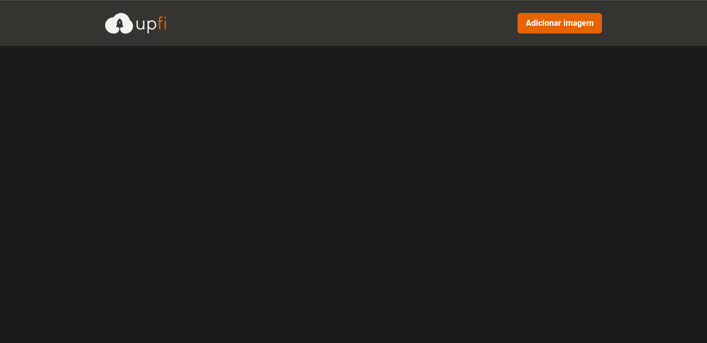
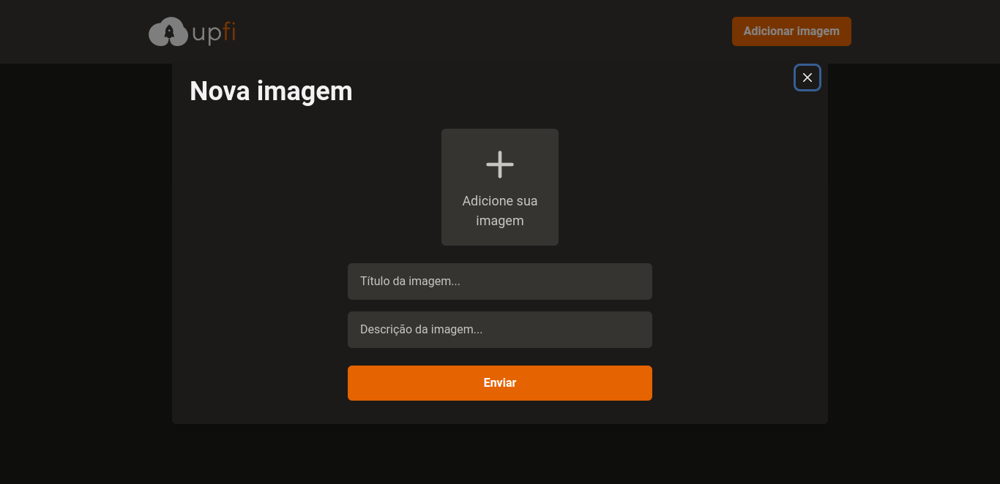
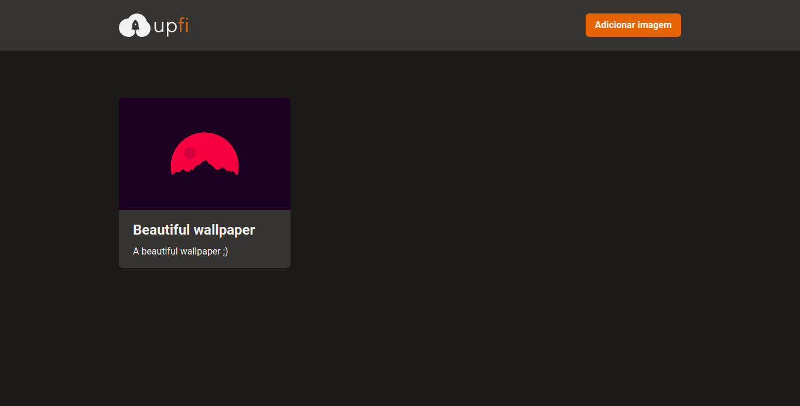
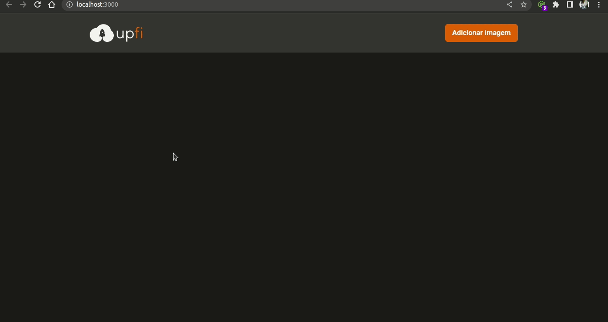

<div align="center">
  
</div>
<h5 align="center">
  Uploads mais fáceis do que nunca!
</h5>

<br/>

<p align="center">
  
  
  
  
</p>
<br>

<p align="center">
  <a href="#sobre">Sobre</a> •
  <a href="#upfi">Upfi</a> •
  <a href="#instalação">Instalação</a> •
  <a href="#tecnologias">Tecnologias</a> •
  <a href="#autor">Autor</a>  
</p>

<br><br><br>

## Sobre

<p>
  Projeto desenvolvido durante o Ignite, um bootcamp criado pela <strong><a href="https://rocketseat.com.br/">Rocketseat</a></strong> com diversas trilhas de variadas tecnologias. O projeto foi criado durante o módulo IV do bootcamp na trilha de <strong><a href="https://pt-br.reactjs.org/">ReactJS</a></strong>.
</p>

## Upfi

Upfi é uma aplicação cujo objetivo é fazer o upload de arquivos de imagem da máquina local para uma CDN, que nesse caso é utilizado o serviço da ImgBB. A aplicação é bem objetiva e tem como página principal a tela abaixo, onde serão listadas as imagens que já foram enviadas para o ImgBB:



Além da lista de imagens (que no caso acima está vazia) temos um botão para realizar os nossos uploads.
Ao clicar no botão **Adicionar imagem** será exibido o formulário abaixo:



Após escolher a imagem desejada, adicionar um titulo e uma descrição a imagem é enviada para a CDN e listada na home do usuário, conforme exemplificado a seguir:



E pronto, imagem foi para a CDN, foi registrada no nosso banco no FaunaDB e já está sendo listada na nossa aplicação.

Interface simples e objetiva para fazer nossos uploads para a CDN do ImgBB. Abaixo um GIF do fluxo completo desde o carregamento da nossa home até o upload da imagem:



## Instalação

Antes de começar, você vai precisar ter instalado em sua máquina as seguintes ferramentas:
[Git](https://git-scm.com), [Node.js](https://nodejs.org/en/).
Além disto é bom ter um editor para trabalhar com o código como [VSCode](https://code.visualstudio.com/).

Antes de executar o projeto será necessário criar e adicionar duas variáveis de ambiente no arquivo .env na raiz do projeto, conforme o [.env.example](./.env.example), onde:

- `NEXT_PUBLIC_IMGBB_API_KEY` corresponde a key da sua conta no [ImgBB](https://imgbb.com/).
- `FAUNA_API_KEY` corresponde a key do banco que precisa ser criando no [FaunaDB](https://fauna.com/). Por padrão o banco e coleção deve ser criado com o nome `images`, caso contrário deverá haver a alteração no código para que tudo funcione corretamente.

### 🖥 Rodando o projeto

```bash
# Clone este repositório
$ git@github.com:MrRioja/uploaderImageReact.git

# Acesse a pasta do projeto no terminal/cmd
$ cd uploaderImageReact

# Instale as dependências
$ npm install
# Caso prefira usar o Yarn execute o comando abaixo
$ yarn

# Por fim, basta executar o projeto em React com o comando abaixo em outro terminal
$ yarn dev

# A aplicação estará disponível localmente e conectada com a nossa API - acesse <http://localhost:3000>
```

## Tecnologias


<br><br><br><br><br><br>

## Autor

<div align="center">

<h1>Luiz Rioja</h1>
<strong>Backend Developer</strong>
<br/>
<br/>

<a href="https://linkedin.com/in/luizrioja" target="_blank">

</a>

<a href="https://github.com/mrrioja" target="_blank">

</a>

<a href="mailto:lulyrioja@gmail.com?subject=Fala%20Dev" target="_blank">

</a>

<a href="https://api.whatsapp.com/send?phone=5511933572652" target="_blank">

</a>

<a href="https://join.skype.com/invite/tvBbOq03j5Uu" target="_blank">

</a>

<br/>
<br/>
</div>
